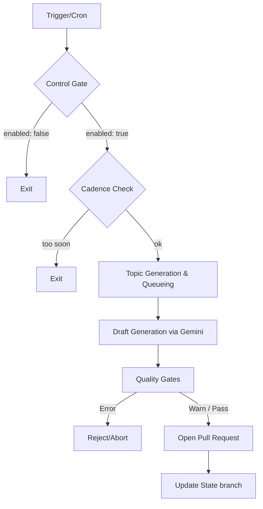

# Blog Agent Architecture & Flow

The `blog-agent` is an autonomous research-and-draft pipeline that periodically creates and proposes new blog posts via Pull Requests. It uses Google's Gemini SDK (`@google/genai`) to generate content.

## High-Level Flow

The agent runs as a scheduled or manual job and follows a strict, state-machine-driven pipeline designed to prevent duplicate publications, avoid stalling the blog, and ensure high-quality content.

## Key Mechanisms

### 1. Style Measurement (Data-Driven Prompting)
Instead of relying on hardcoded, hand-written prompts describing the blog's "style" (which tends to drift over time), the agent **reads existing posts from disk** (`src/corpus/`). 
It mathematically computes a `StyleMetrics` profile:
- Median word counts and paragraph lengths
- Section heading hierarchy (`H2`, `H3` usage)
- Whether posts usually open with an intro vs. a heading
- Frequency of code fences and lists
- Most common tags

This computed style brief is fed to Gemini to ensure new posts seamlessly match the human-authored ones.

### 2. State & Cadence (`src/state/`)
The agent stores its persistent state in JSON files on a dedicated git branch (`blog-agent-state`). This prevents the need for an external database. State files include:
* **`cadence.json`**: Enforces strict publishing rules. It ensures at least 20 hours between posts and uses UTC-day anchoring to prevent cron-job time-drifting. It limits the agent to **1 open PR** at a time so PRs don't pile up.
* **`published.json`**: Tracks the lifecycle (`inflight`, `open`, `merged`, `rejected`) of posts. If the pipeline dies mid-run, it leaves an `inflight` marker, ensuring the next run recovers the job instead of creating a duplicate post.
* **`control.json`**: An operator kill-switch and budget ceiling.
* **`queue.json`**: A backlog of generated topics/angles.

### 3. Quality Gates (`src/gates/`)
Before any PR is opened, the draft is passed through a suite of automated tests. Gates are split into two severities:
- **Warnings**: Do not block the PR, but are listed in the PR body for the human reviewer.
- **Errors**: Fail the pipeline entirely. A legitimately broken post (e.g., missing assets, bad MDX, missing frontmatter) must never be proposed.

**Notable Gates:**
- `compileGate`: Runs the post through the Next.js `contentlayer` build to ensure it parses correctly without breaking the site.
- `assetsExistGate`: Checks that any local images referenced in the markdown actually exist in the `public/` directory.
- `frontmatterGate` & `dateGate`: Ensure metadata is correct.
- `headingHierarchyGate`: Ensures logical H2/H3 nesting and blocks H1s.
- `secretScanGate`: Scans for accidentally leaked keys.
- `externalLinksGate` & `internalLinksGate`: Validates links.

### 4. The CLI (`src/cli.ts`)
The agent can be run via specific CLI commands to test sub-components without triggering a full generation:
* `npm run doctor`: Probes the environment, verifying API keys, model availability, and capability limits (e.g., if Grounded Search and Structured JSON output can be combined).
* `npm run style`: Outputs the machine-derived style brief by analyzing `data/blog/*.mdx`.
* `npm run corpus`: Summarizes what the agent currently sees on disk.

## Summary

The `blog-agent` acts as a hyper-cautious author. It grounds its writing style in your historical posts, schedules itself responsibly using state files on a git branch, and rigorously tests its own markdown against the site's compiler before ever proposing a Pull Request.
