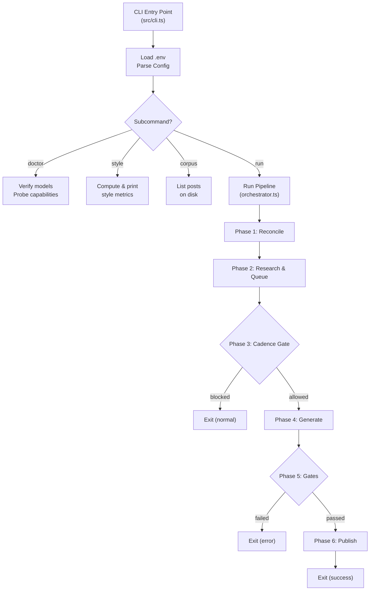
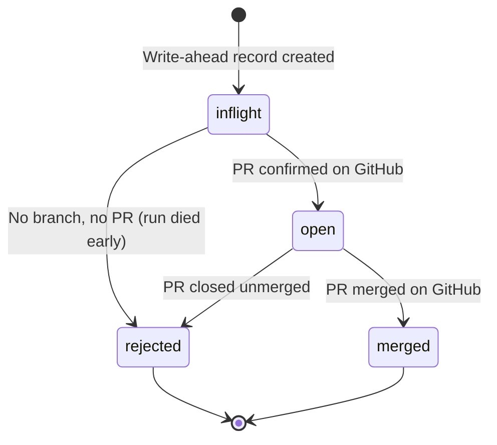
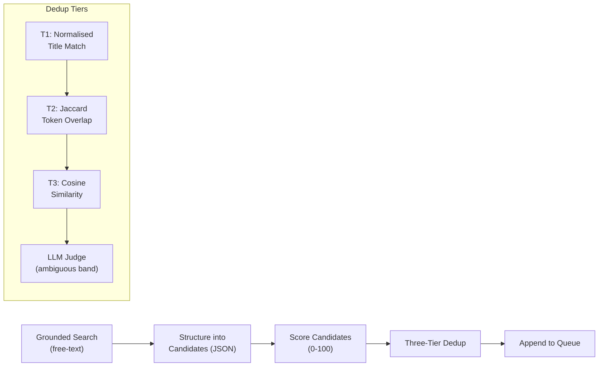
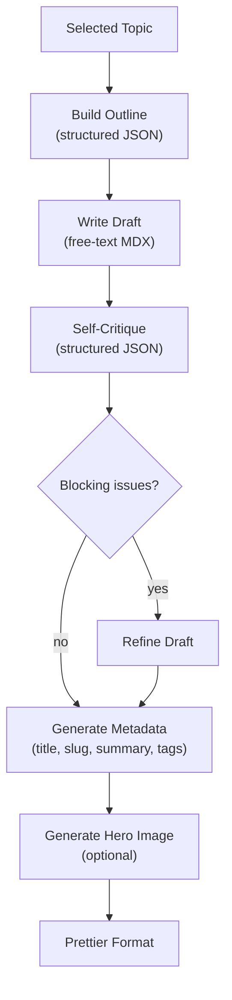
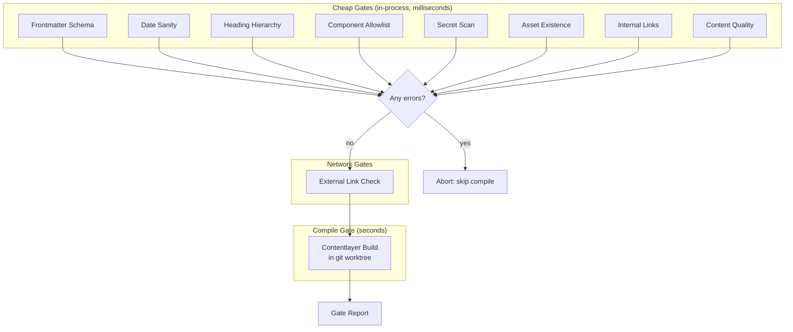
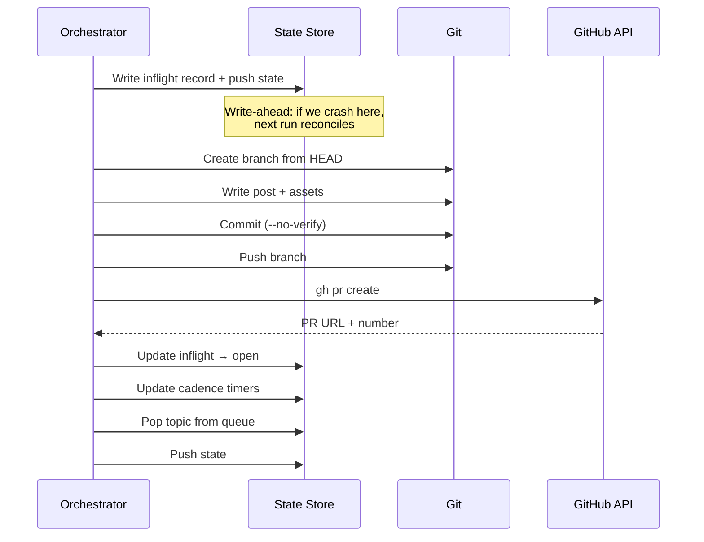
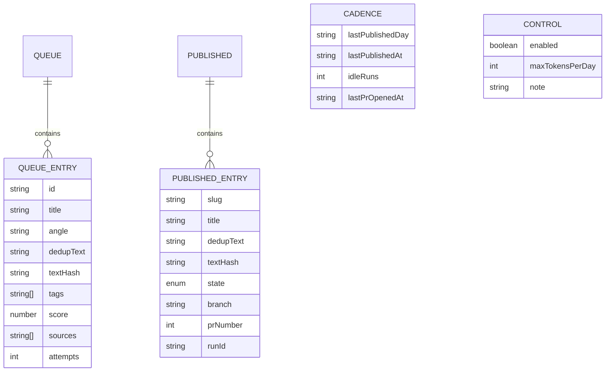

# Architecture

## Overview

Blog Agent is a **pipeline-oriented, single-process CLI** tool. It has no HTTP server, no database, and no background workers. Each invocation is a complete run that advances through a fixed sequence of phases, writes state to JSON files on a dedicated git branch, and exits.

The architecture is deliberately simple: the entire system is a single TypeScript process orchestrated by `src/pipeline/orchestrator.ts`, with all external I/O confined behind two narrow interfaces (`GeminiClient` for AI and `StateStore` for persistence).

## Architectural Pattern

**Phased Pipeline with Write-Ahead State.** Every run progresses through 6 ordered phases. State mutations follow a write-ahead protocol: the agent records intent before acting, so a crash between intent and action can be reconciled on the next run rather than silently duplicating work.



## Phase Ordering Rationale

The phase order is **intentional and non-obvious**:

```
reconcile → research/score/queue → cadence check → draft/gates/publish
```

**Research runs on EVERY invocation; only writing is gated.** If the cadence check came first, three of the four daily runs would exit immediately and the queue would never accumulate. The agent would research roughly once a day and always write about whatever it happened to find that morning. Running research first means the queue builds up over multiple runs and the daily post is chosen from a scored backlog rather than a single sample.

## Pipeline Phases in Detail

### Phase 1: Reconcile (`src/publish/reconcile.ts`)

GitHub is the source of truth. The agent reconciles its local `published.json` against actual GitHub PR states.



**Why it exists:** A run that dies between writing `inflight` state and opening its PR would leave `decidePublish()` blocked forever on the stale entry. Without reconciliation, the agent silently stops publishing while every run exits green.

### Phase 2: Research & Queue (`src/research/discover.ts`, `src/research/dedup.ts`)



The discovery stage is **split into two API calls** because grounded Google Search and constrained JSON output have historically been mutually exclusive in a single Gemini request. The `doctor` command probes whether this restriction still holds.

**Source URL handling:** URLs are carried across in code from the grounding metadata rather than being restated by the model. A model reciting URLs from its own output is a known hallucination surface; the metadata is authoritative.

### Phase 3: Cadence Gate (`src/state/cadence.ts`)

Three independent conditions, all of which must hold:

1. **UTC-day key** — No more than one post per UTC day. Uses a day key (not elapsed time) to be immune to cron jitter.
2. **20-hour floor** — Prevents a 23:50 publish followed by a 00:10 publish.
3. **One open PR** — Caps PR creation, not just publication. Without this, three queued PRs merged together put three back-dated posts live at once.

### Phase 4: Generate (`src/stages/draft.ts`, `src/stages/metadata.ts`)



**Key design decision:** The article body is generated as raw markdown, not JSON. Wrapping an 1,800-word MDX document — with backticks, quotes, and possible JSX — inside a JSON string field is a reliable source of escaping corruption and silent truncation. Metadata is produced by a separate structured call over the finished body.

### Phase 5: Gates (`src/gates/`)



**Ordering is deliberate:** Cheap in-process gates run first so an obvious defect is reported in milliseconds. The expensive Contentlayer build runs only if nothing has already failed. Network gates are skipped when offline.

### Phase 6: Publish (`src/publish/pr.ts`, `src/publish/git.ts`)



## State Management

State is persisted as JSON files on a dedicated git branch (`blog-agent-state`). This provides memory across ephemeral CI runner lifecycles.



### State Files

| File | Purpose | Corruption Behaviour |
|------|---------|---------------------|
| `state/published.json` | Ledger of all posts the agent has created | **Fails loudly.** Silent reset would republish every topic. |
| `state/queue.json` | Scored candidates waiting to be written | **Fails loudly.** |
| `state/cadence.json` | Timestamps tracking last run/publish/PR | **Fails loudly.** |
| `state/control.json` | Kill-switch and budget ceiling | Falls back to `{enabled: true}` on absence |
| `state/embeddings/` | Quantised int8 vectors keyed by text hash | Cache miss → re-embed. Descriptor mismatch → discard. |

### Write Atomicity

All file writes use a **write-then-rename** pattern. Each file is written to a `.tmp` path and atomically renamed, so a process killed mid-write leaves the previous version intact.

## Module Dependency Graph

```mermaid
flowchart TD
    CLI["cli.ts"] --> Pipeline["pipeline/orchestrator"]
    CLI --> Config["config/env"]
    CLI --> Paths["config/paths"]
    CLI --> Gemini["gemini/client"]
    CLI --> Corpus["corpus/reader"]
    CLI --> Style["corpus/style"]
    CLI --> Store["state/store"]
    CLI --> Git["publish/git"]
    
    Pipeline --> Gemini
    Pipeline --> Corpus
    Pipeline --> Style
    Pipeline --> Store
    Pipeline --> Gates["gates/run"]
    Pipeline --> Draft["stages/draft"]
    Pipeline --> Meta["stages/metadata"]
    Pipeline --> PR["publish/pr"]
    Pipeline --> Reconcile["publish/reconcile"]
    Pipeline --> Dedup["research/dedup"]
    Pipeline --> Discover["research/discover"]
    Pipeline --> Cadence["state/cadence"]
    
    Gemini --> Retry["lib/retry"]
    Gemini --> Types["gemini/types"]
    
    Store --> Schema["state/schema"]
    Store --> Hash["lib/hash"]
    Store --> Vector["lib/vector"]
    
    Gates --> Content["gates/content"]
    Gates --> Structure["gates/structure"]
    Gates --> Assets["gates/assets"]
    Gates --> Compile["gates/compile"]
    
    Dedup --> Vector
    Dedup --> Slugify["lib/slugify"]
    
    style CLI fill:#2563eb,color:#fff
    style Pipeline fill:#7c3aed,color:#fff
    style Gemini fill:#059669,color:#fff
    style Store fill:#d97706,color:#fff
    style Gates fill:#dc2626,color:#fff
```



## Key Interfaces

### `GeminiClient` (src/gemini/types.ts)

Every stage is written against this interface, never against the SDK directly. This keeps the SDK's exact shape — which may change — confined to `client.ts` and makes every stage unit-testable with a plain object.

```typescript
interface GeminiClient {
  generateText(opts: GenerateTextOptions): Promise<TextResult>
  generateJson<T>(opts: GenerateJsonOptions<T>): Promise<JsonResult<T>>
  embed(opts: EmbedOptions): Promise<EmbedResult>
  generateImage(opts: GenerateImageOptions): Promise<ImageResult>
  listModels(): Promise<string[]>
  totalUsage(): TokenUsage
}
```

### `StateStore` (src/state/store.ts)

```typescript
interface StateStore {
  readonly root: string
  load(): Promise<AgentState>
  savePublished(v: PublishedFile): Promise<void>
  saveQueue(v: QueueFile): Promise<void>
  saveCadence(v: CadenceFile): Promise<void>
  getEmbedding(textHash: string, descriptor: EmbeddingDescriptor): Promise<number[] | null>
  putEmbedding(textHash: string, descriptor: EmbeddingDescriptor, vector: readonly number[]): Promise<void>
  archiveRejected(slug: string, source: string): Promise<void>
  appendRun(runId: string, record: unknown): Promise<void>
  pruneStaleEmbeddings(descriptor: EmbeddingDescriptor): Promise<number>
}
```

## Error Handling Strategy

- **Config errors** — Fail at startup with readable messages, not eight stages later
- **State corruption** — Fails loudly via `StateCorruptError` (never silently resets)
- **Exhausted quota** — Distinguished from rate limits; fails fast without consuming retry attempts
- **Rate limits** — Retried with exponential backoff + full jitter; honours `Retry-After` and Google's `RetryInfo`
- **Model empty response** — Diagnosed (thinking budget consumed, finish reason) rather than generic "no text"
- **Stall detection** — Logs an error after 12 consecutive idle runs (~72 hours) with no PR opened
